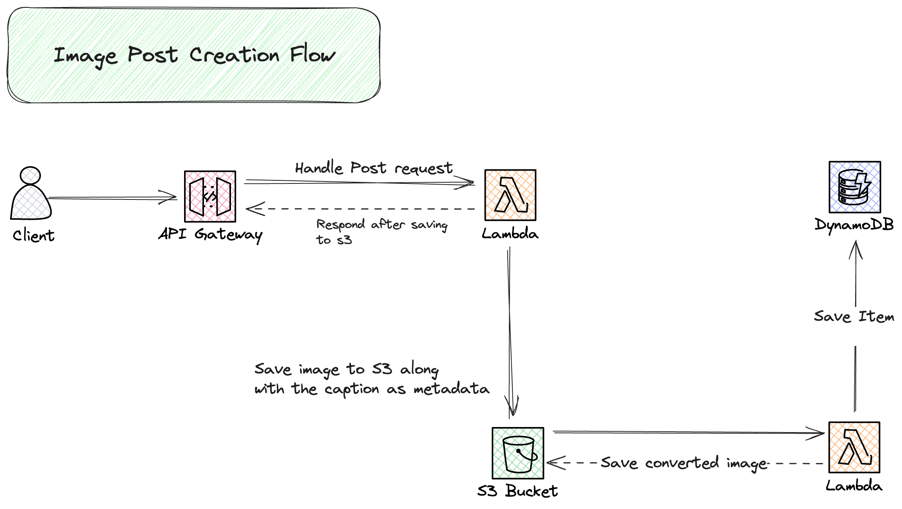
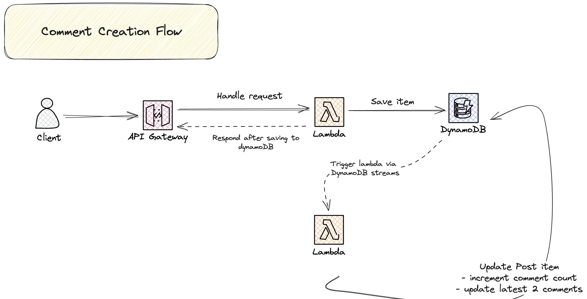
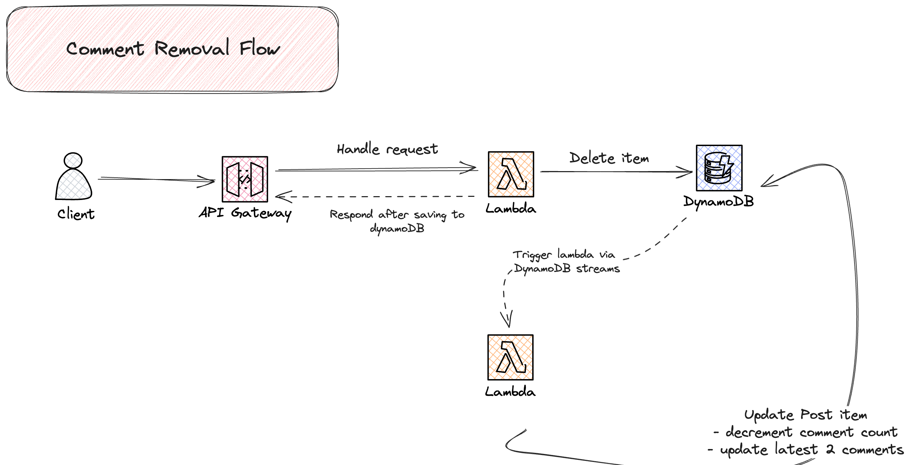
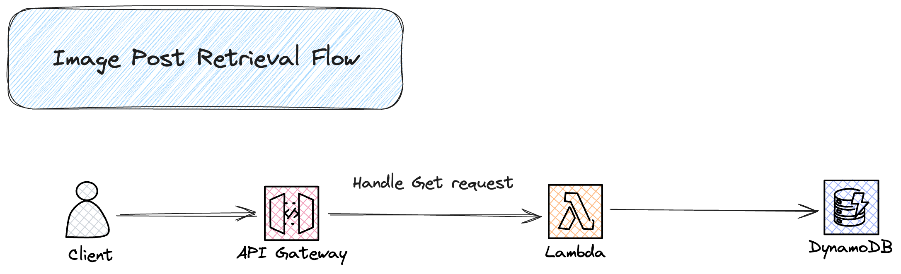

# image-poster-api

## Overview

A prototype for an API that allows clients to post an images with captions and clients can create a comment on each post.

### Constraints

- 1 post can only have 1 image
- A post can have multiple comments
- Minimum throughput: 100 RPS
- Cater for client's unstable internet connection

### Tech stack

- AWS Lambda
- AWS S3
- AWS DynamoDB
- AWS API Gateway

## Flows

### Creating Post



### Creating Comment



### Deleting Comment



### Retrieving Posts



## Design

### Approach / Thought process

Minimize the number of task a procedure needs to perform. Reduce to a single task if possible.

Why?

- Reduces latency. e.g. An endpoint only needs to perform one thing, either upload to S3 or a single call to DynamoDB to fetch/insert item.
- Minimizes the "transactional behavior" problem that arises when a procedure needs to communicate with different kinds of storages. Transactional behavior needs to make sure that transactions are either success or failed (and not in invalid state) by rollback or compensating transactions whenever one of the task failed.

How?

- The API endpoint for creating post only handles uploading to S3. Inserting the `post` item in dynamodb is done in the background.
- The API endpoint for fetching posts, with latest 2 comments, only communicate 1 time in a request because the latest 2 comments are already in the post item in dynamodb. Populating the latest 2 comments in a post is done in the background.

### Limitations

The design prioritizes low latency, high throughput, and could cater for users with unstable internet connections. However, to achieve these constraints, it introduces some tradeoffs which are listed below:

1. The text payload (e.g. caption, user) in `POST /posts` is only limited to 2 KB (around ~2k characters). The limitation is on S3 metadata.
2. Adjusting the number of comments that comes with the `GET /posts` response will not be trivial because the data is being duplicated in the Post entity to reduce latency. _e.g. bumping from latest 2 comments to latest 5 comments_
3. Eventual consistency: newly created post will not show immediately in `GET /posts` endpoint. There's a bit of delay since the DynamoDB item is created in the background. Same with comments.

## Go Live TODOs

- Finish up missing user stories.
- Distributed tracing and logging.
- Setup alerts for errors and anomalies.
- Implement graceful handling of failures and retries.
  - _e.g. image uploaded lambda func encountered an error._
- Implement Authorizer. At the time of writing, user is defined via the `user-id` header which is not very secure.
- Enable delete protection for the dynamodb table.
- Cloudfront to further improve latency.
- E2e automation tests
- Run `STAGE=prod make deploy` to deploy in production environment.

## How To:

```
# run unit tests
make test

# deploy in AWS
make deploy
```

See `Insomnia-collections.yaml` for the endpoint details.
